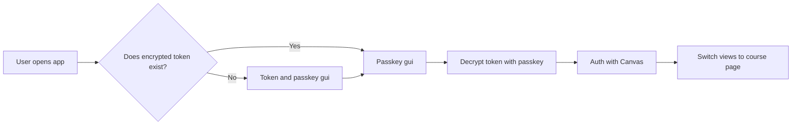
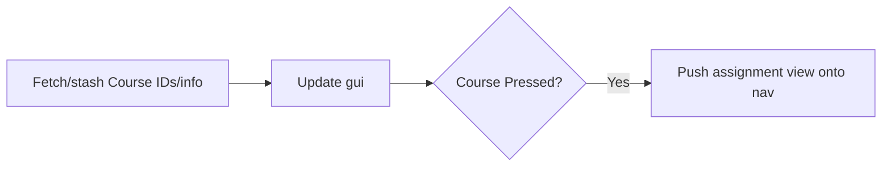
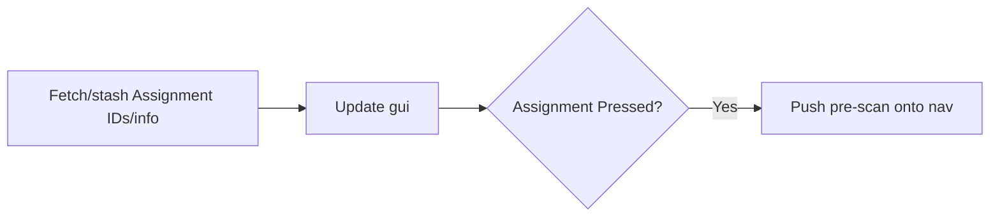

# Process Outlines

## API 'Auth'

```mermaid
flowchart LR
    A[User opens app] --> B{Does encrypted token exist?}
    B -- Yes --> C[Passkey gui]
    B -- No --> D[Token and passkey gui]
    D --> C
    C --> E[Decrypt token with passkey]
    E --> F[Auth with Canvas]
    F --> G[Switch views to course page]
```

## Fetch Courses

```mermaid
flowchart LR
    A[Fetch/stash Course IDs/info] --> B[Update gui]
    B --> C{Course Pressed?}
    C -- Yes --> D[Push assignment view onto nav]
```

## Fetch Assignments

```mermaid
flowchart LR
    A[Fetch/stash Assignment IDs/info] --> B[Update gui]
    B --> C{Assignment Pressed?}
    C -- Yes --> D[Push pre-scan onto nav]
```